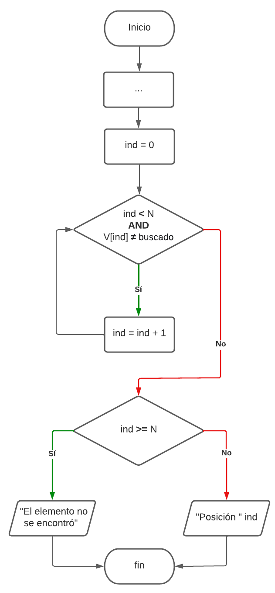

## Algoritmos de búsqueda 

Otro problema importante en proceso de datos, es la búsqueda en un conjunto de datos de un elemento específico y la recuperación de alguna información asociada.

Sólo abordaremos dos métodos de búsqueda:

- Busqueda Secuencial
- Búsqueda Binaria

### Busqueda Secuencial
 
 Esta es la técnica mas simple, consiste en recorrer el arreglo buscando el elemento deseado, desde el primer elemento hasta el último de uno en uno. Si la lista contiene el elemento se devolverá su posición y, en caso contrario, un mensaje que indique el fracaso de la búsqueda. 

 #### Componente

 

 Su funcionalidad consiste en encontrar la posicón de un elemento dentro del arreglo de tamaño **N**, cuyo identificador es **V[]**. El elemento *buscado* es el dato que se busca, este componente incorpora la mejora de controlar el trabajo de inspección de los elementos a través de una condición en la que, una *bandera* permita detener la búsqueda cuando el elemento a buscar es encontrado. Bajo estas condiciones, la lista será recorrida completamente sólo si el elemento buscado es el último o si no está en el arreglo.
